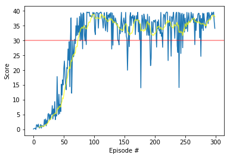

### Learning algorithm
Deep Deterministic Policy Gradient[(DDPG)](https://arxiv.org/abs/1509.02971) algorithm was used for this training.<br>
DDPG applies actor-critic model-free policy gradient method for continuous spaces.

### Hyper-parameters
```python
memory_params = {
    'buffer_size': int(1e6),        # replay buffer size
    'batch_size': 128,              # minibatch size
    'seed': 0,                      # Seed to generate random numbers
}
```

```python
params = {
    'gamma': 0.99,                      # discount factor
    'tau': 1e-3,                        # for soft update of target parameters
    'update_every': 1,                  # update parameters per this number
    'lr_actor': 7e-5,                   # learning rate of the Actor
    'lr_critic': 1e-4,                  # learning rate of the Critic
    'seed': 0,                          # Seed to generate random numbers
    'actor_units': [512, 256],          # Number of nodes in hidden layers of the Actor
    'critic_units': [512, 256],         # Number of nodes in hidden layers of the Critic
    'weight_decay': 0,                  # L2 weight decay
    'noise_theta': 0.15,                # Theta of Ornstein-Uhlenbeck process
    'noise_sigma': 0.01,                # Sigma of Ornstein-Uhlenbeck process
}
```
I tried several learning rates for Actor and Critic among [1e-3, 3e-4, 1e-4, 7e-5, 3e-5, 1e-5].<br>
From those tests, 7e-5(lr of Actor) and 1e-4(lr of Critic) were best.<br>

Also, I tuned number of nodes in layers of Actor and Critic among [512, 256, 128, 64].
[512, 256] was best, but large number of nodes makes long learning time.
So, I stopped to enlarge number of nodes in layers.

Sigma of Ornstein-Uhlenbeck process was the most critical point.<br>
At first, I used 0.2 for the value as default, but the agent cannot learn at all.<br>
After many tries, I found the sigma was very important to learn.<br>
I tested it among [0.2, 0.1, 0.05, 0.01, 0.001, no noise], and 0.01 was best.

### Model architectures
There are two neural networks as the actor and the critic.

* The Actor
1. First layer: (input: state size, 512)
   Activation function: Leaky ReLU
   Batch normalization: (512)
2. Second layer: (512, 256)
   Activation function: Leaky ReLU
   Batch normalization: (256)
3. Output layer: (256, action size)
   Activation function: Tanh

* The Critic
1. First layer: (input: state size, 512)
   Activation function: Leaky ReLU
   Batch normalization: (512)
2. Second layer: (512 + action size, 256)
   Activation function: Leaky ReLU
3. Output layer: (256, 1)
   Activation function: Linear

Leaky ReLU was used instead of ReLU for better performance.<br>
Also, batch normalization made an improvement.<br>
But, batch normalization was ineffective just before output layer of the Critic.<br>

### Plot of Rewards


### Ideas for Future Work
1. Test with multi-agents
It took too long time to train under multi-agents environment.<br>
[MMDDPG](https://arxiv.org/abs/1706.02275) can be used for the environment.

2. Try with another algorithms like PPO

3. Try complex neural network model
I avoid to use complex model due to long learning time.<br>
Just two layers were used for the actor and the critic.
3 or more layers, and more number of nodes in layers could make better performance.
